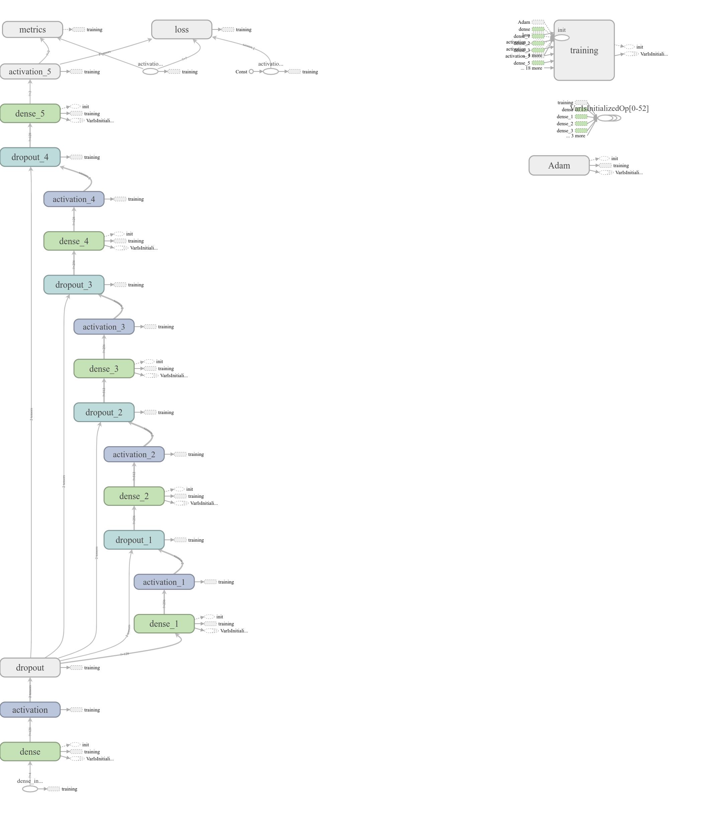
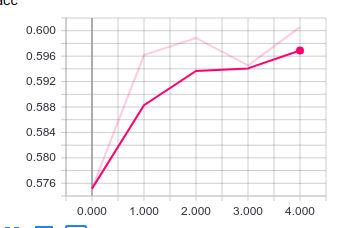
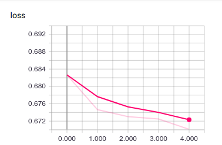
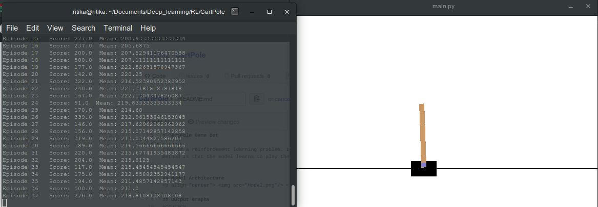
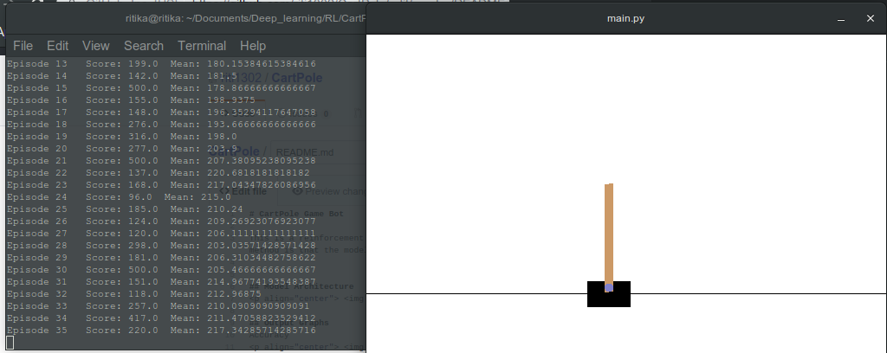

# CartPole Game Bot

This is a reinforcement learning problem. I used Deep Q-learning algorithm to build this game bot.

  

## Usage
Clone or download the repository by following command:    
 
       git clone https://github.com/riti1302/CartPole    
Install the required libraries     

        pip3 install -r requirements.txt    
To run the bot on already trained model run    

        python3 main.py    
To increase the average score of each episode navigate to [getTrainingData.py](getTrainingData.py), update the score and run:     

       python3 getTrainingData.py     
Then navigate to [getModel.py](getModel.py) and update the file_path and saved model name. Then run:    

       python3 getModel.py      
Update the model name in [main.py](main.py) and run:     

       python3 main.py    

## Model Architecture

  

## Output Graphs
Accuracy

  

Loss

  

This model is trained on 5 epochs. The average score after 50 episodes reached 276. For few episodes score reached upto 500.

  

  

 

